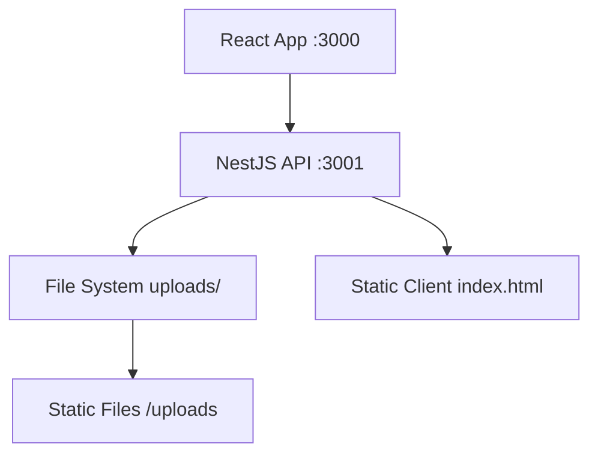

# AGENTS.md
This file provides guidance to Verdent when working with code in this repository.

## Table of Contents
1. Commonly Used Commands
2. High-Level Architecture & Structure
3. Key Rules & Constraints
4. Development Hints

## Commands
- `pnpm install` - Install all dependencies across monorepo
- `pnpm run build` - Build all packages
- `pnpm run start` - Start production NestJS backend
- `pnpm run lint` - Run linting for both packages
- `pnpm run clean` - Clean all build artifacts and node_modules
- Backend specific:
  - `pnpm -C packages/nestjs run start:dev` - Backend dev mode with watch (port 3001)
  - `pnpm -C packages/nestjs run start` - Start backend (port 3001)
  - `pnpm -C packages/nestjs run start:prod` - Start production backend
  - `pnpm -C packages/nestjs run build` - Build NestJS
  - `pnpm -C packages/nestjs run test` - Run backend tests
  - `pnpm -C packages/nestjs run test:e2e` - Run e2e tests
- Frontend specific:
  - `pnpm -C packages/react-app run start` - Start Vite dev server (port 3000)
  - `pnpm -C packages/react-app run build` - Build React app for production
  - `pnpm -C packages/react-app run preview` - Preview production build
  - `pnpm -C packages/react-app run test` - Run frontend tests

## Architecture
- **Monorepo structure** with pnpm workspaces containing 2 packages:
  - `packages/nestjs/` - NestJS backend API server (port 3001)
  - `packages/react-app/` - React frontend with Vite (port 3000)
- **File upload flow**:
  - Frontend: Drag/drop or click upload → FormData → POST to `/uploader`
  - Backend: Multer handles file processing → saves to `client/uploads/` → filename encoding fix for Chinese chars
  - File listing: GET `/uploader` returns FileInfo array with metadata
  - File deletion: DELETE `/uploader/:filename`
- **Tech stack**:
  - Backend: NestJS 11, TypeScript 5.9, Express, Multer 2, fs-extra 11, RxJS 7.8, ConfigService
  - Frontend: React 19.1, Vite 7, TypeScript 5.9, TailwindCSS 3.4, lucide-react, PostCSS, Autoprefixer
  - Node: >=18.0.0
- **Data flow**: React frontend proxies API calls to NestJS backend at port 3001
- **File storage**: Physical files stored in `packages/nestjs/client/uploads/` directory

## Key Rules & Constraints
- **TypeScript**: Do not use `any!` - must maintain strict typing
- **Package manager**: Always detect and use pnpm first, fallback to npm/yarn
- **File handling**: Support Chinese filenames with proper encoding (latin1 → utf8 conversion via Buffer)
- **Security**: Path traversal protection required - use path.resolve() and verify file paths stay within UPLOAD_DIR
- **Filename sanitization**: Use path.basename() to prevent directory traversal in originalname
- **File upload**: Single file endpoint is active via FileInterceptor('file', { dest: UPLOAD_DIR })
- **React component size**: Maximum 140 lines per component file
- **Vite dev proxy**: Frontend dev server routes /uploader and /uploads to http://localhost:3001

## Development Hints
- **Backend upload controller**: Located in `packages/nestjs/src/uploader/uploader.controller.ts`
  - GET /uploader: Returns sorted file list with metadata (name, type, size, uploadTime)
  - POST /uploader: Accepts single file via FileInterceptor, renames with decoded original name
  - DELETE /uploader/:filename: Deletes file with path validation
- **Frontend upload hook**: useFileUpload(onSuccess) at `packages/react-app/src/hooks/useFileUpload.ts`
  - Returns: dragActive, uploading, uploadProgress[], overallProgress, handleDrag, handleDrop, handleChange
  - Uses XMLHttpRequest POST to ./uploader with FormData field name 'file'
  - Tracks per-file progress and triggers onSuccess callback after successful upload
- **Filename handling**: Use Buffer.from(originalname, 'latin1').toString('utf8') for proper Chinese character decoding
- **Development workflow**: Run backend and frontend in separate terminals:
  - Terminal 1: `pnpm -C packages/nestjs run start:dev` (NestJS with watch)
  - Terminal 2: `pnpm -C packages/react-app run start` (Vite dev server with proxy)
- **Production build**: Build frontend first, then copy to backend:
  - `pnpm -C packages/react-app run build`
  - Copy build output to packages/nestjs/client/ (ServeStaticModule serves from there)
  - `pnpm -C packages/nestjs run build && pnpm -C packages/nestjs run start:prod`
- **File upload flow**: Frontend FormData → XMLHttpRequest → Vite proxy :3000 → NestJS :3001 → Multer → Rename with decoded filename → ServeStatic /uploads
- **Common pitfalls**: 
  - setupProxy.js (CRA style) is unused; use Vite proxy in vite.config.ts for dev
  - Production needs explicit copy of React build to packages/nestjs/client
  - Filename collision: Consider adding timestamp or uuid suffix to prevent overwrites