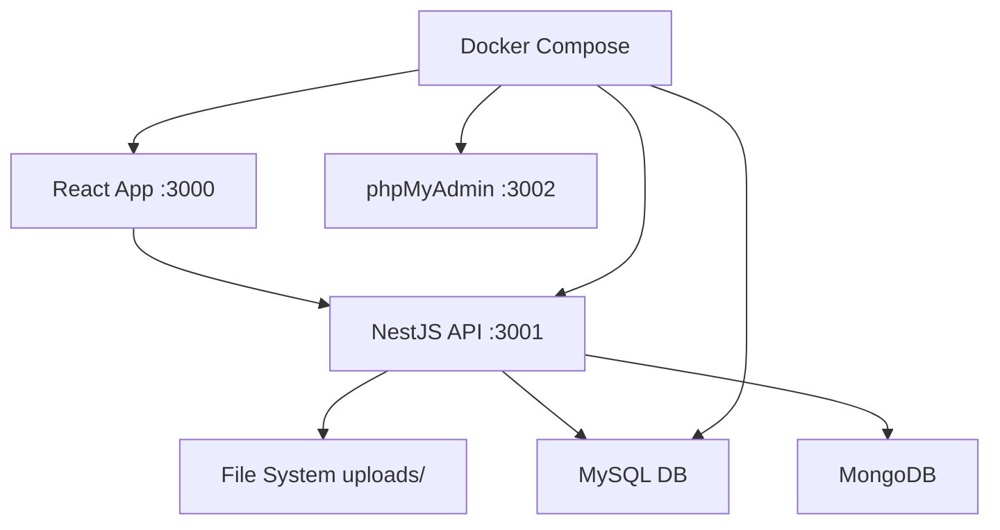

# AGENTS.md
This file provides guidance to Verdent when working with code in this repository.

## Table of Contents
1. Commonly Used Commands
2. High-Level Architecture & Structure
3. Key Rules & Constraints
4. Development Hints

## Commands
- `pnpm install` - Install all dependencies across monorepo
- `pnpm run build` - Build all packages
- `pnpm run dev` - Start both backend and frontend in development
- `pnpm run start` - Start production NestJS backend
- `pnpm run lint` - Run linting for both packages
- `pnpm run clean` - Clean all build artifacts and node_modules
- Backend specific:
  - `cd packages/nestjs && npm run test` - Run backend tests
  - `cd packages/nestjs && npm run test:e2e` - Run e2e tests
  - `cd packages/nestjs && npm run start:dev` - Backend dev mode (port 3001)
- Frontend specific:
  - `cd packages/react-app && npm run build` - Build React app
  - `cd packages/react-app && npm run test` - Run frontend tests

## Architecture
- **Monorepo structure** with pnpm workspaces containing 2 packages:
  - `packages/nestjs/` - NestJS backend API server (port 3001)
  - `packages/react-app/` - React frontend with Vite (port 3000)
- **File upload flow**:
  - Frontend: Drag/drop or click upload → FormData → POST to `/uploader`
  - Backend: Multer handles file processing → saves to `client/uploads/` → filename encoding fix for Chinese chars
  - File listing: GET `/uploader` returns FileInfo array with metadata
  - File deletion: DELETE `/uploader/:filename`
- **Tech stack**:
  - Backend: NestJS, TypeScript, GraphQL, Express/Fastify, Multer, fs-extra
  - Frontend: React 19, TypeScript, NextUI, TailwindCSS, Vite, Framer Motion
  - Database options: MySQL, MongoDB, PostgreSQL (configurable)
  - Deployment: Docker Compose with MySQL + phpMyAdmin
- **Data flow**: React frontend proxies API calls to NestJS backend at port 3001
- **File storage**: Physical files stored in `packages/nestjs/client/uploads/` directory

## Key Rules & Constraints
- **TypeScript**: Do not use `any!` - must maintain strict typing
- **Package manager**: Always detect and use pnpm first, fallback to npm/yarn
- **File handling**: Support Chinese filenames with proper encoding (latin1 → utf8 conversion)
- **Security**: Path traversal protection for file operations [inferred]
- **File upload**: Single file endpoint is active, multi-file upload code is commented out
- **Environment**: Uses configuration service for ports and database connections

## Development Hints
- **Adding new upload endpoints**: Extend `UploaderController` with new `@Post()` methods and `@UseInterceptors()`
- **Frontend styling**: Uses NextUI components with TailwindCSS and custom gradient backgrounds
- **File processing**: Use `handlerFiles()` method for consistent filename encoding across upload endpoints
- **Database setup**: Environment files in each package configure DB connections (MySQL, MongoDB)
- **Proxy setup**: Frontend uses `setupProxy.js` to route API calls to backend [inferred]
- **Docker development**: Use `docker-compose up` for full development environment with DB
- **Error handling**: Backend throws `HttpException` with proper status codes, frontend logs errors to console