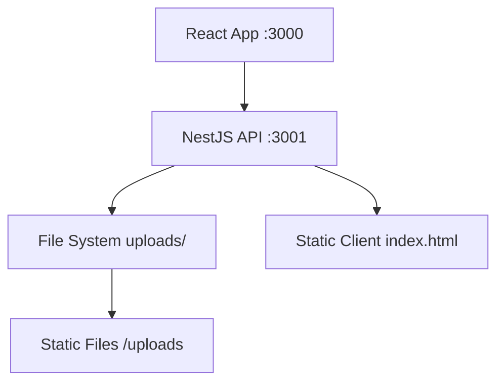

# AGENTS.md
This file provides guidance to Verdent when working with code in this repository.

## Table of Contents
1. Commonly Used Commands
2. High-Level Architecture & Structure
3. Key Rules & Constraints
4. Development Hints

## Commands
- `pnpm install` – Install all dependencies across the monorepo
- `pnpm run build` – Build all packages (backend + frontend)
- `pnpm run lint` – Run linting for backend and frontend
- `pnpm run clean` – Clean all build artifacts and node_modules
- `pnpm -C packages/nestjs run start` – Start backend (port 3001)
- `pnpm -C packages/react-app run start` – Start Vite dev server (port 3000)
- `pnpm -C packages/nestjs run build` – Build NestJS backend only
- `pnpm -C packages/react-app run build` – Build React app only
- `pnpm -C packages/nestjs run test` – Run backend Jest tests (all)
- `pnpm -C packages/react-app run test` – Run frontend Vitest tests (all)
- `pnpm -C packages/nestjs run test:watch` – Example single-test workflow (filter inside Jest UI)

## Architecture
- Monorepo with pnpm workspaces containing two main packages:
  - `packages/nestjs/` – NestJS backend API server (port 3001)
  - `packages/react-app/` – React + Vite frontend (port 3000)
- File upload lifecycle:
  - Frontend: drag/drop or click → `FormData` → POST `/uploader`
  - Backend: Multer `FileInterceptor('file')` → saves into `packages/nestjs/client/uploads/` → fixes Chinese filename encoding
  - Listing: `GET /uploader` returns sorted file metadata array
  - Deletion: `DELETE /uploader/:filename` removes a validated file
- Tech stack:
  - Backend: NestJS 11, TypeScript 5.9, Express, Multer 2, fs-extra 11, RxJS 7.8, ConfigService
  - Frontend: React 19.1, Vite 7, TypeScript 5.9, TailwindCSS 3.4, lucide-react, PostCSS, Autoprefixer
  - Runtime: Node >=18.0.0
- Data flow:
  - Dev: React app uses Vite proxy to call NestJS at `http://localhost:3001` for `/uploader` and `/uploads`
  - Prod: NestJS serves static built React client and the `/uploads` directory
- Entry points:
  - Backend entry: `packages/nestjs/src/main.ts` (starts HTTP server on port 3001)
  - Frontend entry: `packages/react-app/src/index.tsx` (Vite dev server on port 3000)

## Key Rules & Constraints
- TypeScript:
  - Do not use `any` or `any!`; maintain strict typing.
- Package manager:
  - Use `pnpm` for all install/run tasks (root is a pnpm workspace).
- File handling and security:
  - Support Chinese filenames via `Buffer.from(originalname, 'latin1').toString('utf8')`.
  - Protect against path traversal: use `path.resolve` and ensure final paths stay under the configured upload directory.
  - Sanitize incoming filenames with `path.basename` before using them on the filesystem.
- Upload behavior:
  - Active endpoint: single-file upload via `FileInterceptor('file', { dest: UPLOAD_DIR })` on `/uploader`.
  - Physical files live under `packages/nestjs/client/uploads/`.
- React/TypeScript frontend:
  - Keep each React component file ≤140 lines and favor container/presentational separation and custom hooks for non-trivial logic. [inferred]
- Dev tooling and proxies:
  - Vite dev proxy handles `/uploader` and `/uploads` to `http://localhost:3001`; `setupProxy.js`-style config is not used.
- From README:
  - Project is an uploader web app; Docker usage example exists but AGENTS.md is the main source of detailed dev docs. [inferred]

## Development Hints
- Adding a new API endpoint (backend NestJS):
  - Place controllers/services under `packages/nestjs/src/**` following existing module structure (for uploads, see `uploader` module).
  - Reuse existing validation and path-safety helpers when touching filesystem-related logic.
  - Expose new routes under a consistent prefix (e.g., extend `/uploader` or add a new module) and wire them into the main app module.
- Extending or adjusting file upload behavior:
  - Main controller: `packages/nestjs/src/uploader/uploader.controller.ts` (GET list, POST upload, DELETE file).
  - Preserve encoding fix for Chinese filenames and path traversal checks whenever changing upload or delete behavior.
- Frontend integration and hooks:
  - Upload logic lives in `packages/react-app/src/hooks/useFileUpload.ts` (drag state, per-file progress, overall progress, handlers).
  - When adding UI features, keep components lean and move business logic into hooks or context to respect the 140-line rule. [inferred]
- Local development workflow:
  - Run backend dev server: `pnpm -C packages/nestjs run start:dev`.
  - Run frontend dev server: `pnpm -C packages/react-app run start`.
  - Vite proxy will forward API and static uploads calls to the backend.
- Production build and serve:
  - Build frontend: `pnpm -C packages/react-app run build`.
  - Ensure built assets are available under `packages/nestjs/client/` so NestJS `ServeStaticModule` can serve them.
  - Build and start backend in prod: `pnpm -C packages/nestjs run build && pnpm -C packages/nestjs run start:prod`.
- Testing:
  - Backend uses Jest (`pnpm -C packages/nestjs run test` / `test:watch`).
  - Frontend uses Vitest (`pnpm -C packages/react-app run test`).
